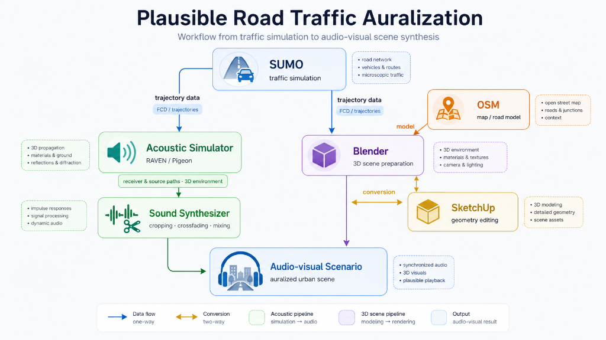
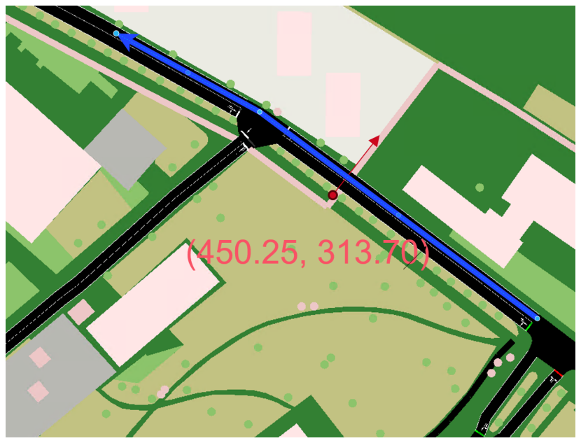
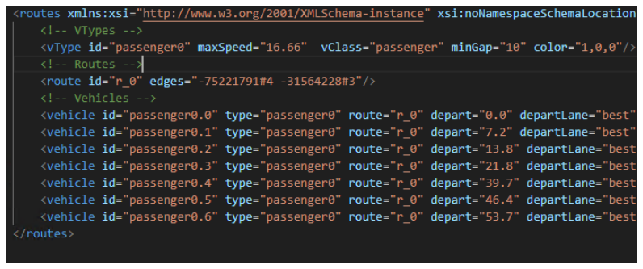
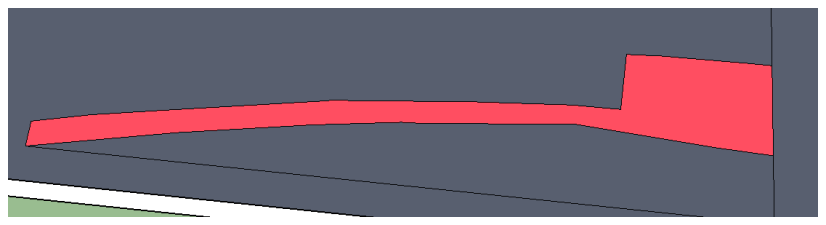
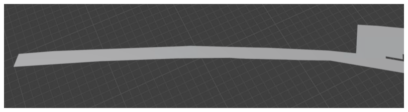

# Plausible Road Traffic Auralization

Code framework for preparing road traffic auralization workflows from microscopic traffic simulation and 3D trajectory data.

This repository contains the public code skeleton developed around a research project on road traffic auralization. It illustrates the workflow connecting **SUMO** traffic simulation, **Blender** / **SketchUp** / **OSM** 3D scene preparation, geometric acoustic simulation (**RAVEN** / **Pigeon**), and post-simulation sound synthesis.

---

## Workflow Overview

The overall workflow connects traffic simulation, 3D spatial modeling, acoustic simulation, and audio synthesis:



### Workflow Stages

1. **Traffic Simulation (SUMO)**
   - Microscopic traffic flow simulation and vehicle route generation.
   - Trajectory data extraction (`FCD` / Floating Car Data).

2. **3D Scene Preparation (OSM, Blender, SketchUp)**
   - OpenStreetMap (`OSM`) map data integration for spatial road context.
   - 3D scene environment, materials, camera views, and lighting setup in **Blender**.
   - 3D geometry editing and detailed modeling in **SketchUp**.

3. **Acoustic Simulation & Sound Synthesis (RAVEN, Pigeon, Sound Synthesizer)**
   - 3D sound propagation and material reflection/absorption modeling in **RAVEN** and **Pigeon**.
   - Rendered audio grain signal processing in **Sound Synthesizer**: timestamp cropping, crossfading, and multi-vehicle mixing.

4. **Audio-Visual Scenario Output**
   - Synchronized audio playback and 3D visual scene rendering for urban traffic auralization.

---

## Representative Simulation Inputs

| SUMO Map Setup | SUMO Route Output |
|:---:|:---:|
|  |  |

| RAVEN Road Scene Model | Pigeon Road Scene Model |
|:---:|:---:|
|  |  |

---

## Project Structure

```text
.
├── configs/                   # Example configuration templates
├── docs/                      # Documentation and workflow assets
│   └── assets/                # Architecture diagrams and scene figures
├── examples/                  # Synthetic sample data (SUMO configs, trajectory CSVs)
├── matlab/                    # Script templates for Pigeon and RAVEN batch processing
├── scripts/                   # Trajectory processing and utility scripts
├── src/                       # Python helper package (`plausible_traffic_auralization`)
├── tests/                     # Lightweight unit checks
└── pyproject.toml             # Python package configuration
```

---

## Repository Scope & Disclaimer

> [!NOTE]
> This public repository contains only the anonymized code framework and script templates. It **does not** contain complete datasets or third-party binaries required for full end-to-end reproduction.

- **Included**: Python helper logic for SUMO FCD parsing, trajectory interpolation, acoustic simulator config generation, and audio grain cropping/crossfading functions.
- **Excluded**: Third-party binaries and toolboxes (SUMO, RAVEN, Pigeon, MATLAB/ITA Toolbox, Blender, SketchUp), raw measurement data, proprietary 3D scene files, rendered audio, and personal/institutional metadata.
